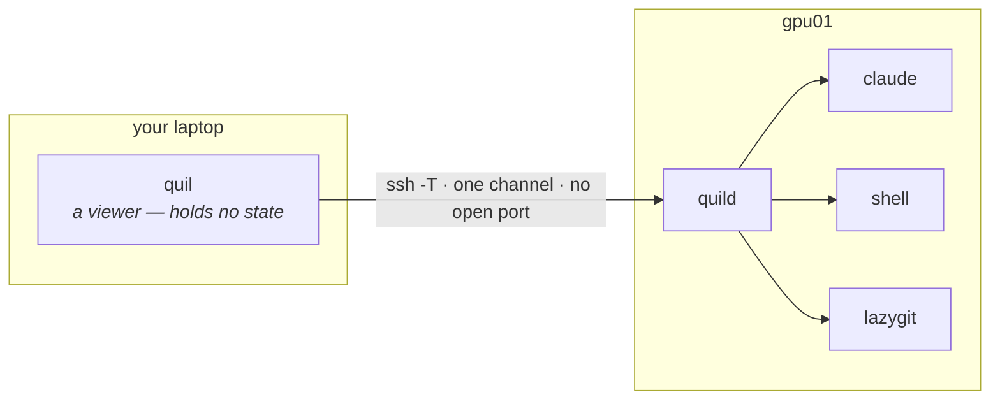

# Quil

**The persistent workflow orchestrator for AI-native development.**

[](LICENSE)
[](https://go.dev)
[](#install)
[](docs/mcp.md)

---

A terminal multiplexer built for developers who orchestrate 5–10 sessions per project across AI assistants, build watchers, webhook tunnels, and SSH connections. Unlike tmux, Quil understands **projects** and **typed panes**: it persists your entire workspace across reboots, auto-resumes AI conversations by session id, and lets your AI assistant drive your terminal over [MCP](docs/mcp.md).

Type `quil` after a reboot — every tab, pane, working directory, layout split, and AI conversation is right where you left it.

<p align="center">
  
</p>

## See it

| Survives a full reboot | AI drives your terminal |
|:---:|:---:|
|  |  |
| Panes, working dirs, and AI sessions snap back in ~30s. | Expose Quil over MCP — agents list panes, read output, send keys. |
| **Many projects, one window** | **Typed panes** |
|  |  |
| Focus mode + a dozen project tabs. | Per-type setup: dir browser, resume strategy, permission toggles. |
| **Resize with the mouse** | **Right-click pane menu** |
|  |  |
| Drag any split border — nested panes clamp to minimums, PTYs see one resize on release. | Per-pane actions under the cursor: history, notes, lazygit, attention pin, restart, close. |
| **Command palette: jump anywhere** | **…and run anything** |
|  |  |
| `Alt+Shift+P` fuzzy-finds every pane and tab — navigation grouped at the top. | Every action grouped below, each showing its keybinding; type to filter instantly. |
| **…and search inside every pane** | **Jump to the match** |
|  |  |
| Start typing and the palette also searches every loaded pane's scrollback — match counts + a preview under **Found in panes**. | `Enter` on a pane match jumps straight to it. Searches loaded panes; lazily-restored panes appear once you open them. |
| **Every project in one sidebar** | **…including ones on other machines** |
|  |  |
| Projects group tabs and roll up their agents — `▲` needs you, `⠹` working (spinning), `✓` finished while you were elsewhere. Per-pane git branch underneath. | A remote host is a sibling row with its host under the name. Its panes run over there; the sidebar reports them exactly like local ones. |

## Install

**Linux / macOS** — one-line install (detects OS+arch, verifies SHA-256):

```bash
curl -sSfL https://raw.githubusercontent.com/artyomsv/quil/master/scripts/install.sh | sh
```

**Windows** — download `quil-windows-amd64.zip` from [Releases](https://github.com/artyomsv/quil/releases/latest), extract anywhere on `PATH`.

**Go users**:

```bash
go install github.com/artyomsv/quil/cmd/quil@latest
go install github.com/artyomsv/quil/cmd/quild@latest
```

Full install options + build-from-source — see [docs/installation.md](docs/installation.md).

## Quick start

```bash
quil          # launches the TUI, auto-starts the daemon
```

Five keys to remember:

| Key | Action |
|---|---|
| `F1` | Menu — Settings, Plugins, Memory, log viewers |
| `Ctrl+N` | New typed pane (Claude Code, OpenCode, shell, …) |
| `Ctrl+T` | New tab |
| `Ctrl+W` | Close active pane |
| `Ctrl+Q` | Quit (workspace persists) |

That's enough to start. See [docs/quick-start.md](docs/quick-start.md) for the first-launch walkthrough and [docs/keybindings.md](docs/keybindings.md) for the full keymap.

If anything ever hangs: `quil restart` recovers the daemon (escalating stop → fresh start → tabs restored from the last snapshot), and `Alt+R` restarts a single stuck pane in place with its AI session resumed.

## One window, every project

A **project** groups tabs, owns a root directory, and belongs to one daemon.
`Alt+Shift+S` opens a sidebar listing all of them at once, and that is the point:
an agent that finished — or got stuck asking you something — in a project you are
*not* looking at is visible from the one you are.

Each project row rolls up its panes: `▲` blocked on you, `⠹` working (spinning), `✓` finished
while you were elsewhere. **Blocked and finished are different states**, because
they need different things from you. `Alt+Shift+A` jumps to whichever agent has
been waiting longest anywhere in the workspace — oldest first rather than sidebar
order, since that is the one costing you time.

Under the active project each pane also shows the checkout it sits in — branch,
`wt` for a linked worktree, `↑N`/`↓N` against upstream. Cached per checkout, so
ten panes in one repository cost one `git` invocation, and a probe that does not
answer keeps its last value marked stale rather than guessing.

| Key | Action |
|---|---|
| `Alt+Shift+S` | Toggle the sidebar |
| `Alt+Shift+N` | New project |
| `Alt+P` | Fuzzy project picker |
| `Alt+O` | Bounce between the two most recent |
| `Alt+Shift+A` | Jump to the agent waiting longest, across every project |

Existing workspaces migrate on first load into a single project named `Default`,
tab order preserved — no prompt, nothing to opt into. Full detail in
[docs/features.md](docs/features.md#projects).

## Run the work somewhere else

```bash
quil --remote gpu01
```

The machine doing the work and the machine you sit at are increasingly not the
same one — a GPU box, a cluster node, a beefy desktop reached from a laptop. An
AI agent mid-task is exactly the workload you least want tied to a laptop lid.



**No port is opened on the remote.** Quil runs `ssh -T gpu01 "quil --stdio"` and
speaks its normal protocol over that single channel, so anything SSH reaches
works — a bastion behind `ProxyJump`, a Tailscale address, a box on the public
internet. The destination goes to `ssh` verbatim, so your `~/.ssh/config` keeps
working: `Host` aliases, jump hosts, per-host keys, hardware tokens, certificates.

**The server needs nothing installed first.** Point `--remote` at a bare machine
and it offers to install one, then attaches. Your laptop downloads the release
for the *remote's* platform and pushes it over the connection you already have,
so a node with no route to GitHub provisions as easily as one with.

**Or add the host without leaving the TUI.** Tick **Remote (ssh)** in the New
Project dialog and press Enter on the Host row — Quil dials it, installs or
upgrades Quil there if it needs to, then browses *that machine's* filesystem for
the root directory:

| Dialling, and provisioning what it finds | Connected — now browsing the remote disk |
|:---:|:---:|
|  |  |
| The one message line is coloured by what it *means* — red only when the host cannot be reached at all, amber while work is under way. | Green once the link is up. The directory list comes from the server, so `~`, relative paths and drive roots all describe the right machine. |

**A dropped link is a pause, not an ending.** Close the lid, lose wifi, change
network — an amber bar names the host, counts the attempts, and shows what `ssh`
said, retrying with backoff until it lands. The panes never stopped, so there is
nothing to resume. Keystrokes are *dropped* rather than queued while the link is
down: a key typed at a dead connection would otherwise arrive minutes later in a
live agent session, answering a question that had already moved on.

**Every dialog describes the server, not your laptop.** The working-directory
picker, `~`, relative paths, drive and root listings, git-repository discovery,
kube contexts, which tools are installed, and the recent-directories list all
ask the daemon. Before that, `Alt+G` could report no repository in a directory
where the agent *in that very pane* answered `git status` with the branch name.

Beta, and honest about it: plugin *definitions* still come from your local
machine, the daemon detects installed tools only at startup and on plugin
reload, `quil status` and the update controls refuse rather than retargeting,
and remotes must be Linux or macOS. Details and the roadmap are in
[docs/features.md](docs/features.md#remote-daemon-over-ssh).

## Let your AI assistant drive Quil

Add this to your AI client's MCP config (Claude Desktop, Claude Code, Cursor, VS Code Copilot):

```json
{
  "mcpServers": {
    "quil": {
      "command": "quil",
      "args": ["mcp"]
    }
  }
}
```

Restart the client. The AI can now `list_panes`, `read_pane_output`, `send_to_pane`, `watch_notifications`, `screenshot_pane`, and 12 more tools. Read the build pane and react to errors without copy-paste.

Full guide: [docs/mcp.md](docs/mcp.md).

## Built-in integrations

Typed panes ship for the tools developers run all day. Each opens from `Ctrl+N`; the ones that wrap an external binary appear only when that binary is on `PATH` (greyed with an install link otherwise).

| Integration | What it is |
|---|---|
| **Terminal** | Your system shell (bash/zsh/PowerShell/fish) with live working-directory tracking. |
| **Claude Code** | AI coding session that resumes the exact conversation by session id across reboots. |
| **OpenCode** | AI coding session ([opencode](https://opencode.ai)) with the same per-pane session resume. |
| **lazygit** | Git TUI ([lazygit](https://github.com/jesseduffield/lazygit)) for the repo near the pane — also a per-tab `Alt+G` overlay. |
| **hunk** | Review-first diff viewer ([hunk](https://github.com/modem-dev/hunk)) for reading what an agent just wrote — also a per-tab `Alt+D` overlay, sharing lazygit's slot. |
| **k9s** | Kubernetes cluster TUI ([k9s](https://github.com/derailed/k9s)) with a context picker sourced from your kubeconfig. |
| **lazysql** | Database TUI ([lazysql](https://github.com/jorgerojas26/lazysql)) for MySQL, PostgreSQL, SQLite, and MSSQL. |
| **SSH** | Persistent SSH session that re-runs the same command (host, port, forwards) on restart. |
| **Stripe CLI** | `stripe listen` webhook tunnel that restores its forward URL and surfaces the signing secret. |

Define your own pane types in TOML — see the [plugin reference](docs/plugin-reference.md).

## Documentation

| Topic | Doc |
|---|---|
| **Installation** | [installation.md](docs/installation.md) |
| **First launch** | [quick-start.md](docs/quick-start.md) |
| **All features** | [features.md](docs/features.md) |
| **Keybindings** | [keybindings.md](docs/keybindings.md) |
| **Configuration** | [configuration.md](docs/configuration.md) |
| **MCP (AI integration)** | [mcp.md](docs/mcp.md) |
| **Custom plugins** | [plugin-reference.md](docs/plugin-reference.md) |
| **Troubleshooting** | [troubleshooting.md](docs/troubleshooting.md) |
| **Architecture (24 ADRs)** | [architecture.md](docs/architecture.md) |
| **Roadmap** | [roadmap.md](docs/roadmap.md) |
| **Vision** | [vision.md](docs/vision.md) |
| **Original PRD** | [prd.md](docs/prd.md) |

The full doc index lives at [docs/README.md](docs/README.md).

## Contributing

See [CONTRIBUTING.md](CONTRIBUTING.md) for branch / commit conventions and the development workflow. Bug reports and PRs welcome.

## License

[MIT](LICENSE) — Copyright (c) 2026 Artjoms Stukans

The Windows build bundles Microsoft's MIT-licensed [OpenConsole](https://github.com/microsoft/terminal) (`OpenConsole.exe` + `conpty.dll`) to host terminal panes correctly on Windows 10. See [THIRD_PARTY_LICENSES.md](THIRD_PARTY_LICENSES.md) for full third-party attribution.
